# SFosu!

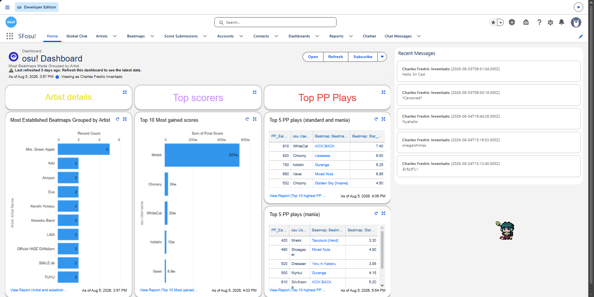

A self-project app built for learning, experimenting, and documenting the process of creating something real from scratch.

This repository is my personal project space where I share my progress, mistakes, lessons, and small wins while building SFosu!. I am not claiming perfection here — I expect bugs, rough edges, and features that may not work exactly as intended. The goal is to learn, improve, and document what is happening along the way.

## Why I built this

I wanted to challenge myself by creating an app that pushes me to apply the things I have learned in development: design, coding, debugging, problem solving, UI/UX decisions, and project planning.

This is not just about shipping a perfect app. It is about building something meaningful, learning from the process, and sharing my journey honestly.

## Project vision

SFosu! is a personal app project meant to explore ideas, test concepts, and build something that reflects my current learning and creativity.

It may evolve over time, change direction, or go through several iterations. That is part of the process.

## App overview

These screens represent the first thing a viewer sees when opening each main tab in the app. They give a quick idea of the purpose and feel of the experience before diving deeper into the features.

### Home screen


The Home screen is the landing view and the clearest introduction to the app. It presents the main entry point, helping users understand the app’s identity and giving them a quick sense of flow, focus, and navigation.

### Global chat screen

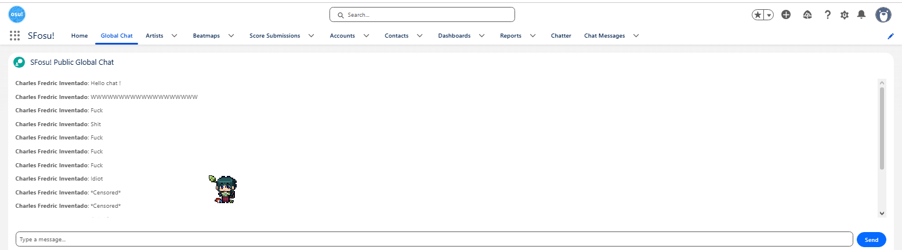

The Global Chat screen opens the experience to a broader community. It communicates that the app supports shared discussion and public interaction, making the environment feel active and connected beyond one-to-one communication.

### Artist screen

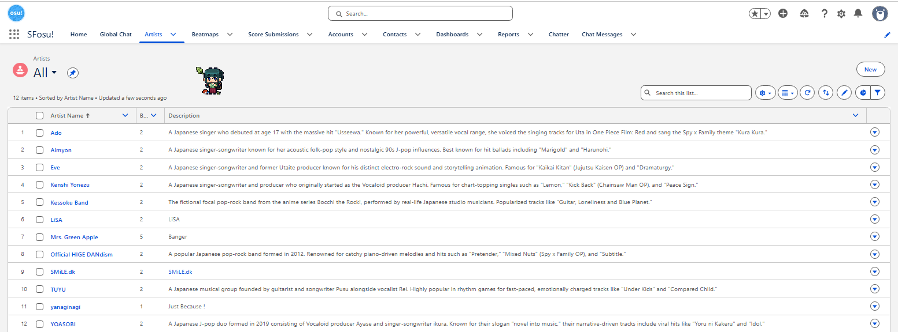

The Artist screen focuses on the creative side of the app and presents the person or entity behind the music or content. It helps viewers connect the interface to the people creating the experiences they are interacting with.

#### Artist related tab

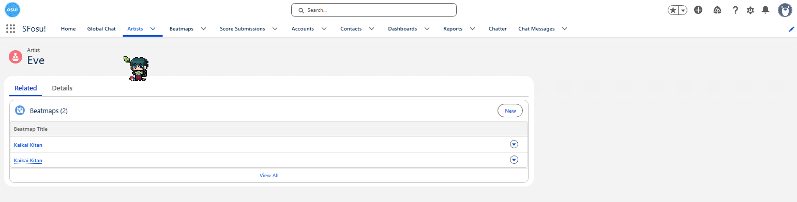

The Related tab expands the artist view by showing content connected to that artist. It helps users continue exploring the same artist through related music, entries, and associated material without leaving the record context.

#### Artist details tab

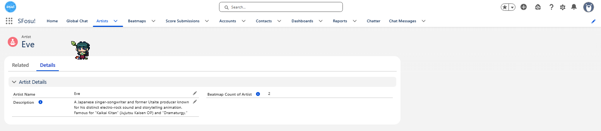

When a specific artist record is selected, the Details tab shows the core profile information first. This view is meant to give a quick understanding of who the artist is and what information is most relevant at a glance.

### Beatmap screen

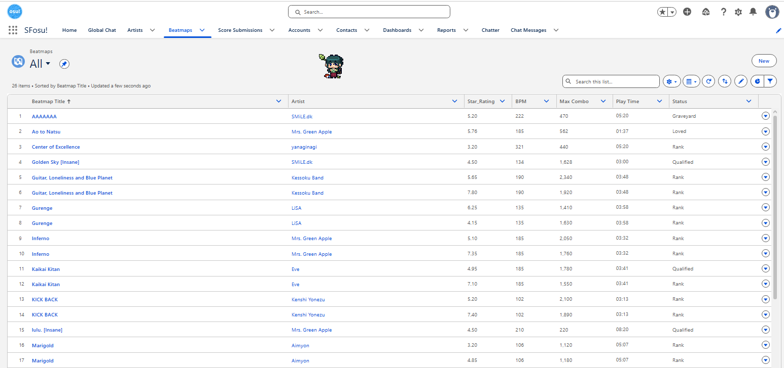

The Beatmap screen is where content detail becomes more specific and tangible. It introduces the actual playable or browsable content, giving users a first look at the maps, tracks, or music-based material that drives the experience.

#### Beatmap related tab

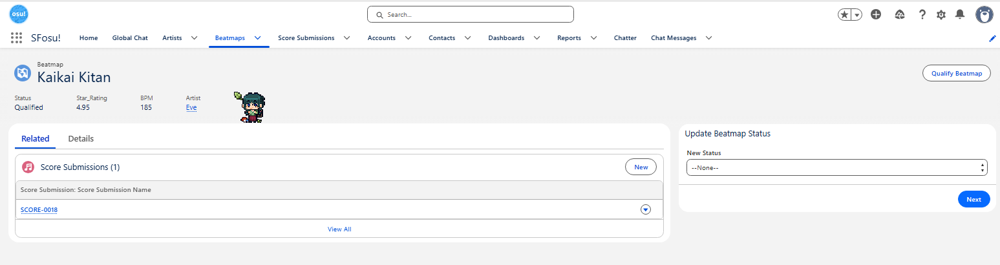

The Related tab keeps the exploration going by surfacing linked or similar beatmaps and associated content. It helps the user discover more relevant entries instead of stopping at the initial record.

#### Beatmap details tab

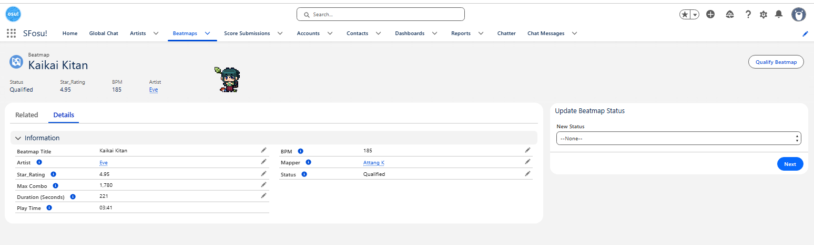

When a specific beatmap is opened, the Details tab gives the essential information for that map. This is the first place a user looks to understand the content, difficulty, and overall purpose of the record.

### Score submissions screen

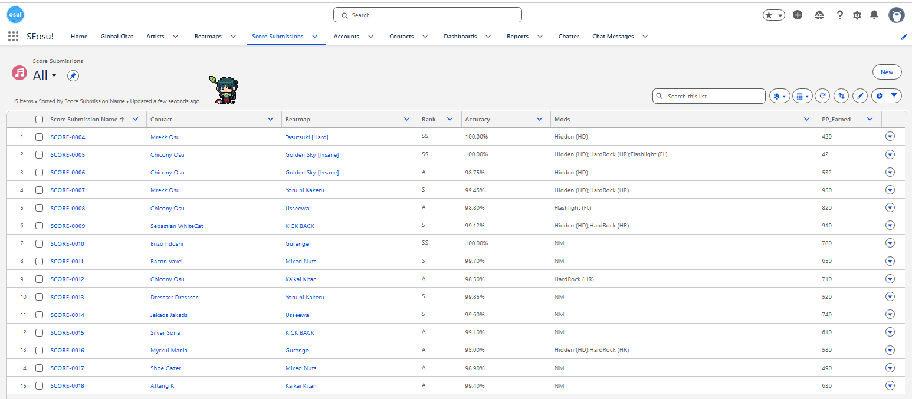

The Score Submissions screen introduces the competitive or performance-tracking side of the app. It tells the viewer that results and achievements are tracked, reviewed, and presented as part of the overall experience.

#### Score submissions details tab

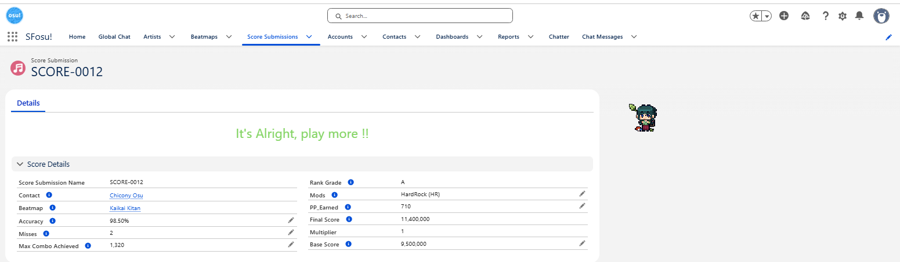

The Details tab is the main view for score submissions and is the only tab in this area. It highlights the specific submission information, making it the most important place for reviewing results and understanding the relevant performance data.

### Accounts screen

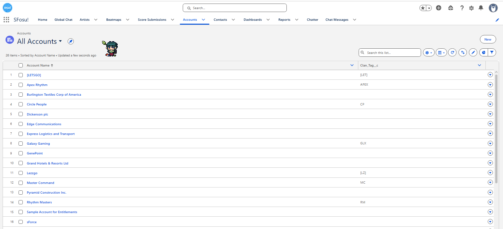

The Accounts screen is where the user’s personal identity and profile context are made visible. This tab is important because it gives a sense of ownership, personal details, and the account-level structure that supports the rest of the app.

#### Accounts related tab

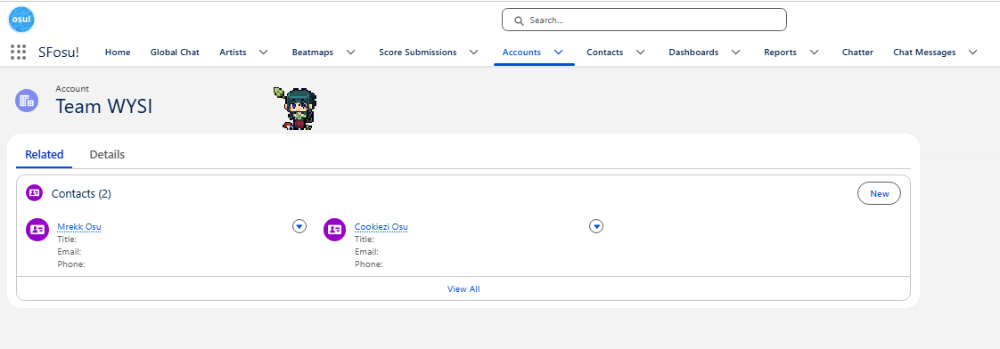

The Related tab for Accounts expands the profile context by showing connected or associated content linked to that account. It helps the user continue exploring the account through related entries without losing the main identity context.

#### Accounts details tab

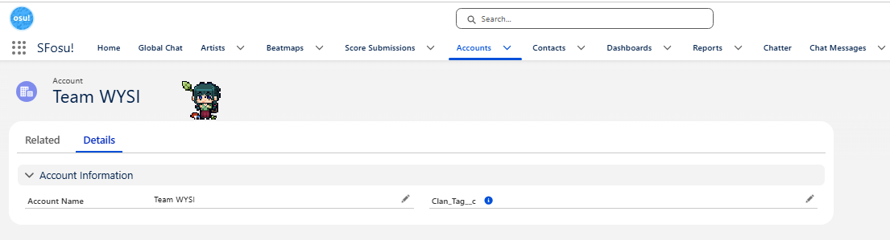

The Details tab provides the key account information in a structured and readable way. It is the place where the app presents the most relevant personal or account-level information in a concise, focused view.

### Contacts screen

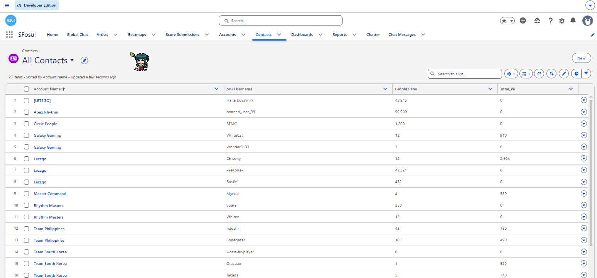

The Contacts screen is designed around connection and relationships. It is the place where a user sees who they can reach, who is relevant, and how the app supports communication between people or groups.

#### Contacts related tab

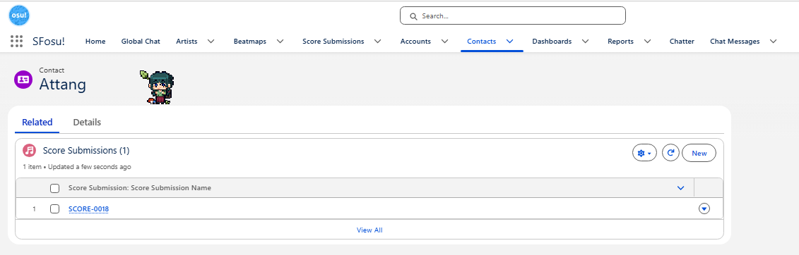

The Related tab for Contacts broadens the social context by surfacing connected people, groups, or relevant entries tied to that contact. It helps the user keep exploring relationships without leaving the contact view.

#### Contacts details tab

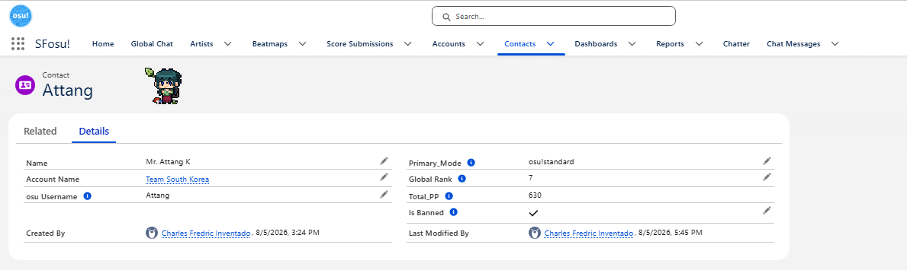

The Details tab focuses on the essential information for a selected contact. It gives the clearest view of who that person is and what information is most relevant for communication or follow-up.

### Dashboard screen

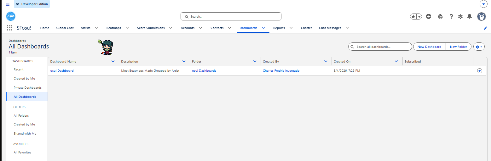

The Dashboard is the overview tab where the most important information is surfaced first. It is designed to make a user feel oriented by showing a high-level summary of activity, progress, and key areas of the platform at a glance.

### Reports screen

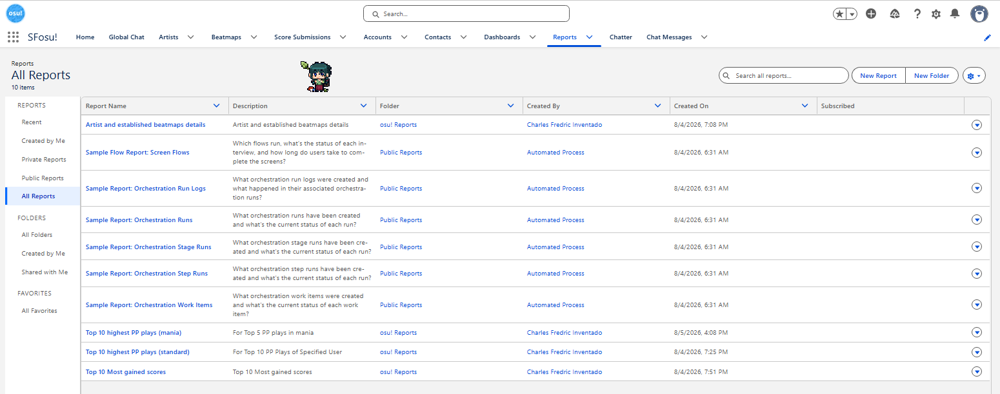

The Reports screen represents the operational and oversight side of the app. It is the place where data, issues, and summaries are reviewed, signaling that the platform is structured enough to monitor activity and maintain quality.

#### Artist details report outline

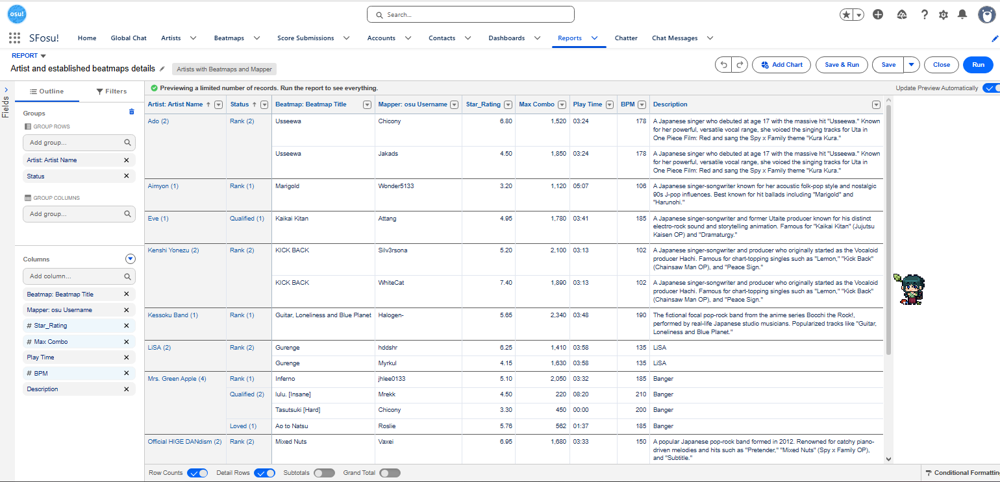

This report shows the artist-focused summary and established beatmap detail view first, making it easy to see the overall information structure before narrowing into filters or deeper results.

#### Artist details report filters


The filters for the artist details report let the user narrow the data by the relevant selection criteria, making the report more focused and easier to interpret.

#### Top 10 scores report outline

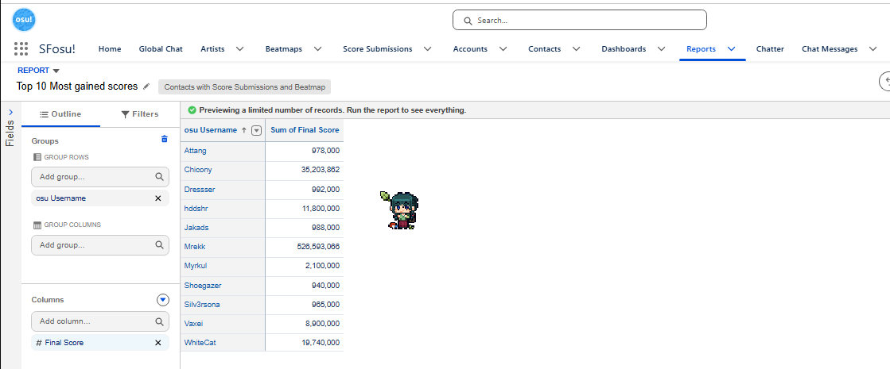

The Top 10 Scores report outline highlights the ranking structure and the scoring view first, presenting the core information in a clear and immediately readable format.

#### Top 10 scores report filters

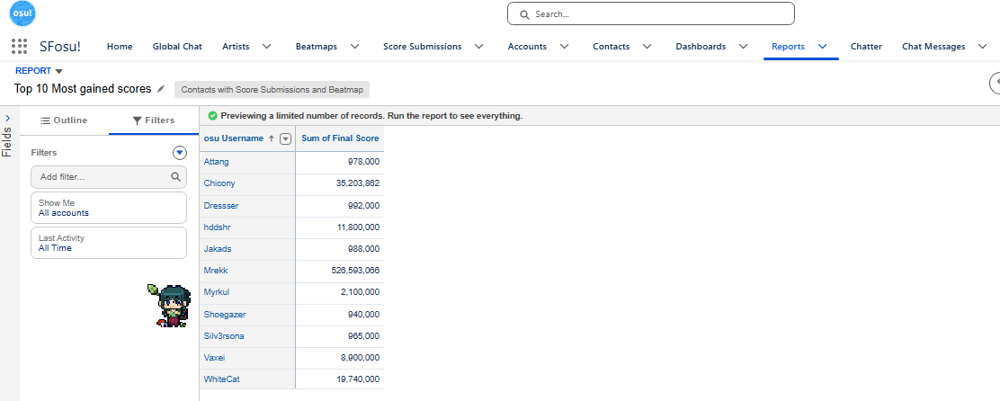

The filters for the Top 10 Scores report refine the report by adjusting the scoring criteria, letting the user focus on the ranking view they want to inspect.

#### Top 10 PP plays standard outline

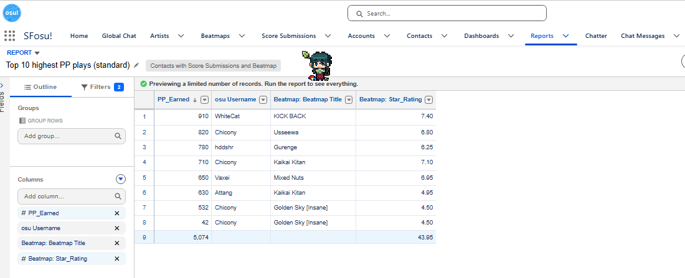

The Top 10 PP Plays Standard report outline presents the standard performance ranking view first, focusing on the most relevant results and how they are framed for comparison.

#### Top 10 PP plays standard filters

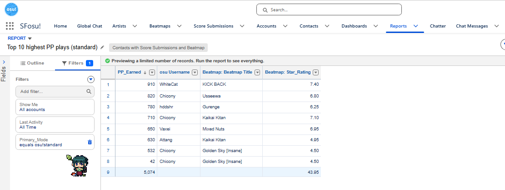

The filters for the Standard PP report narrow the data by the relevant performance criteria so the ranking is easier to compare and interpret.

#### Top 5 PP plays mania outline

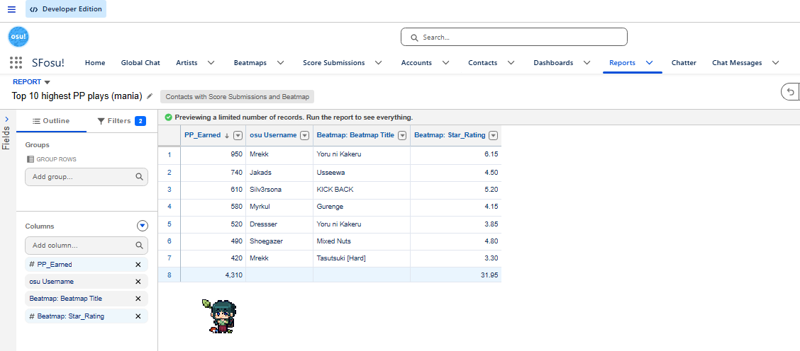

The Top 5 PP Plays Mania outline focuses on the mania-specific leaderboard structure, giving the user a clear view of how the highest-performing entries are framed and ranked.

#### Top 5 PP plays mania filters

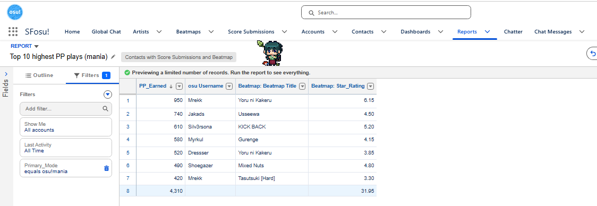

The filters for the Mania PP report refine the view by adjusting the relevant criteria, helping the user isolate the exact performance data they want to review.

### Chatter screen

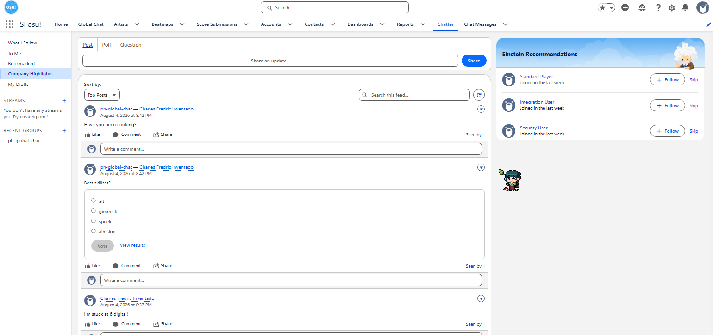

The Chatter screen is the tab for direct social interaction in the app. It gives the first impression that the platform is not just content-based but also community-driven, encouraging conversation and personal connection.

### Chat messages screen

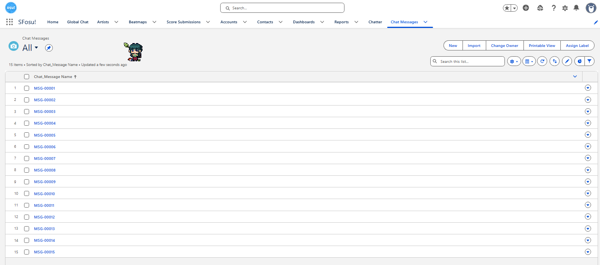

The Chat Messages screen is where the app feels more alive and immediate. This tab shows the value of ongoing communication, making the first impression one of responsiveness, conversation, and direct interaction.

#### Chat messages related tab

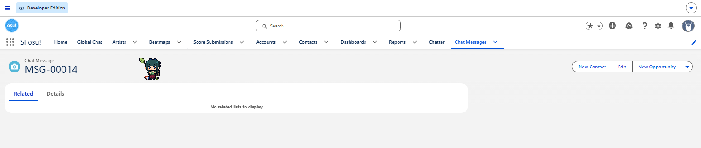

The Related tab for Chat Messages expands the conversation context by surfacing connected content and relevant follow-ups. It helps the user continue exploring the discussion beyond the immediate message.

#### Chat messages details tab

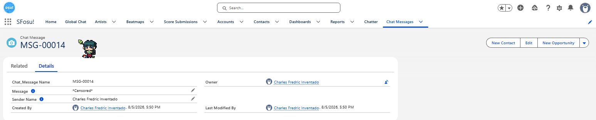

The Details tab focuses on the specific conversation content, making it the place where the user can inspect the full message context and the most important information tied to that exchange.

## How I built it from scratch

These images show the early app-manager workflow I used to build the project from the ground up. They document the step-by-step structure I created when designing the app foundation before moving into the full interface and feature work.

### App manager app overview

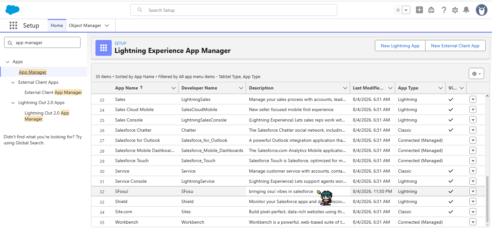

This is the starting point of the app manager, where the overall app structure and basic foundation were defined. It shows how the project began as a clean, organized system rather than a fully finished interface.

### App manager navigation items

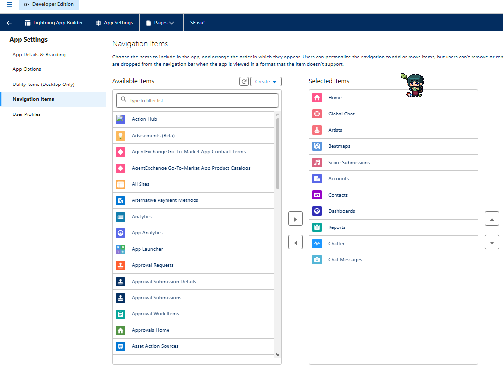

This screen shows the navigation system that was set up early in the process. It highlights the app’s initial structure and how the main sections were planned to guide users through the experience.

### App manager user profiles

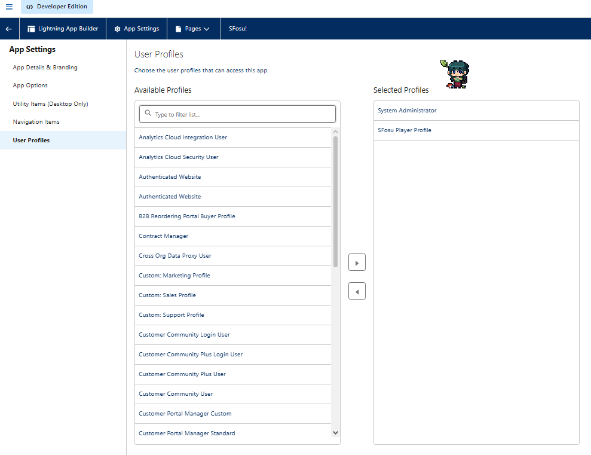

This part of the app manager focuses on user identity and profile setup. It captures how the app was organized around accounts, user information, and the personal context needed for the rest of the experience.

### App manager app details and branding

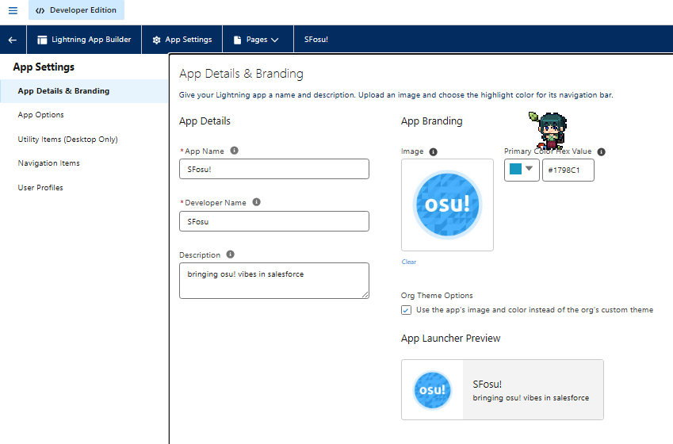

This screen covers the app details and branding layer, which is where the project starts to feel more complete. It reflects the step where the identity, branding, and key app metadata were defined alongside the functionality.

## Current status

This project is currently in a learning and experimentation phase.

- Some features may be incomplete
- Some parts may not work as expected
- Bugs are expected
- Improvements are ongoing
- The project is meant to grow through trial and error

> Disclaimer: I may have a lot of bugs, broken logic, or unpolished features. I still try my best to apply what I have learned, fix issues when I can, and explain what is happening in the process.

## What I want to achieve

- Learn by building
- Improve my coding and problem-solving skills
- Practice real-world app development
- Keep a record of progress and mistakes
- Share the journey with others who are also learning

## Development approach

This project is a hands-on learning experience. I am focusing on:

- understanding the problem
- trying solutions
- debugging what fails
- testing ideas
- improving step by step
- documenting what I discover

There is no pressure to make everything perfect right away. The important part is learning, adapting, and moving forward.

## Project structure

This repository is currently a starting point for the project and may evolve as development continues.

```text
Sfosu-/
├── README.md
├── assets/
├── src/
├── docs/
├── tests/
└── ...
```

## Getting started

This section will be updated as the project grows.

For now, this is meant as a personal project repository and learning log.

```bash
git clone https://github.com/YourUsername/Sfosu-.git
cd Sfosu-
# Install dependencies here when the project setup is ready
# Run the app here when the project structure is ready
```

## Stack and tools

The actual tech stack will be added as the project is developed.

This project may include technologies such as:

- frontend or mobile framework
- backend or local data handling
- APIs or services
- state management
- testing tools
- UI design and asset work

## Learning goals

I want to keep improving in these areas:

- app architecture
- UI/UX design
- debugging and troubleshooting
- writing maintainable code
- learning from mistakes
- documenting my process clearly

## Vlog / project journey notes

This project is also part of my self-documentation journey. I plan to discuss:

- what I am trying to build
- what I learned from it
- what failed and why
- how I fixed issues
- what I still need to improve
- how the project changes over time

The goal is not to hide the messy parts. The goal is to show honest progress.

## A note about the process

Not everything will be polished.
Not every feature will work perfectly.
Not every idea will succeed on the first try.

But that is part of real development, and I am learning through it.

## Final note

SFosu! is a personal project, a learning journey, and a place to document growth.

I may not have everything figured out yet, but I am trying my best to apply what I have learned and share the process honestly.

Thank you for following along.

---

Built with patience, curiosity, and a lot of trial and error.
