# SFosu!


A self-project app built for learning, experimenting, and documenting the process of creating something real from scratch.

This repository is my personal project space where I share my progress, mistakes, lessons, and small wins while building SFosu!. I am not claiming perfection here — I expect bugs, rough edges, and features that may not work exactly as intended. The goal is to learn, improve, and document what is happening along the way.

## Why I built this

I wanted to challenge myself by creating an app that pushes me to apply the things I have learned in development: design, coding, debugging, problem solving, UI/UX decisions, and project planning.

This is not just about shipping a perfect app. It is about building something meaningful, learning from the process, and sharing my journey honestly.

## Project vision

SFosu! is a personal app project meant to explore ideas, test concepts, and build something that reflects my current learning and creativity.

It may evolve over time, change direction, or go through several iterations. That is part of the process.

## Documentation

The detailed notes for each topic are organized into separate files in the docs folder so this README stays as a concise project landing page.

- [docs/architecture.md](docs/architecture.md) — custom objects, standard objects, field design, and data model
- [docs/permissions.md](docs/permissions.md) — profiles, permissions, CRUD access, and privilege issues
- [docs/chat.md](docs/chat.md) — global chat flow, censoring, and visibility problems
- [docs/dashboard.md](docs/dashboard.md) — dashboard, reports, and chart-vs-table decisions
- [docs/ux.md](docs/ux.md) — navigation order, recent messages, list-view actions, and UX tweaks

## Implemented code

These are the main Salesforce files added for the chat feature and project setup.

### Apex classes

- [classes/ChatController.cls](classes/ChatController.cls) — retrieves recent chat messages and inserts new ones
- [classes/RecentChatFeedController.cls](classes/RecentChatFeedController.cls) — returns the latest chat feed summary
- [classes/ChatControllerTest.cls](classes/ChatControllerTest.cls) — test coverage for chat retrieval behavior
- [classes/RecentChatFeedControllerTest.cls](classes/RecentChatFeedControllerTest.cls) — test coverage for recent feed behavior

### Lightning Web Components

- [lwc/publicChatRoom/publicChatRoom.js](lwc/publicChatRoom/publicChatRoom.js) — live chat room logic using EmpApi and Apex calls
- [lwc/publicChatRoom/publicChatRoom.html](lwc/publicChatRoom/publicChatRoom.html) — public chat room UI
- [lwc/chatFeed/chatFeed.js](lwc/chatFeed/chatFeed.js) — recent message feed wiring
- [lwc/chatFeed/chatFeed.html](lwc/chatFeed/chatFeed.html) — recent message feed markup

## App overview

These screens represent the first thing a viewer sees when opening each main tab in the app. They give a quick idea of the purpose and feel of the experience before diving deeper into the features.

### Home screen


The Home screen is the landing view and the clearest introduction to the app. It presents the main entry point, helping users understand the app’s identity and giving them a quick sense of flow, focus, and navigation.

The recent messages section on the home screen is intentionally limited to the 5 most recent messages so the page stays concise, readable, and focused without overwhelming the user with older chat activity.

I also adjusted the visible fields across the object list views so that both the Recently Viewed and All Records tabs only show the most relevant columns for osu! users. The goal is to surface the details users actually need at a glance, without cluttering the screen with extra Salesforce-style fields that are not useful for this app. This reduces the number of clicks needed to understand a record and keeps each tab focused on the information that matters most.

One of the design ideas for the home screen is the osu! dashboard, which acts like a central overview page for the app. It can contain the four main reports that are also visible in the Reports section, giving users a quick summary of the overall platform without making them dive directly into the detailed reporting views. In a practical sense, the dashboard is the high-level summary page, while the Reports section is where the more detailed evidence and filters live.

This also influenced how I think about the visualizations. Some charts are not automatically the best choice for every dataset. For example, for the "Most Gained Scores" view, a bar chart may be misleading if the difference between the top scorer and the next ranks is very large. In that case, a table-based ranking may be clearer and more honest because it makes the value gaps easier to inspect and compare without distorting the significance of the leaderboard.

### Global chat screen


The Global Chat screen opens the experience to a broader community. It communicates that the app supports shared discussion and public interaction, making the environment feel active and connected beyond one-to-one communication.

The Global Chat area also revealed a permission problem during testing. The admin profile was able to send and test censored messages using a filter flow, where bad words such as "shit," "fuck," and "idiot" were replaced with "*Censored*". That flow worked in the admin context, but I struggled to get the standard player profile to see the admin’s messages or access the same chat behavior correctly. This suggests the issue was not only with the filter itself but also with visibility settings, sharing rules, or page-level permissions for the standard player profile.

At the moment, I am also unable to properly test role hierarchy permissions in the project, which means I still need to work out how to structure user roles and record-level visibility correctly. This is an important gap because role hierarchy affects how data is shared across users and can easily explain why a normal player cannot see admin chat content when they should be able to.

### Artist screen


The Artist screen focuses on the creative side of the app and presents the person or entity behind the music or content. It helps viewers connect the interface to the people creating the experiences they are interacting with.

#### Artist related tab


The Related tab expands the artist view by showing content connected to that artist. It helps users continue exploring the same artist through related music, entries, and associated material without leaving the record context.

#### Artist details tab


When a specific artist record is selected, the Details tab shows the core profile information first. This view is meant to give a quick understanding of who the artist is and what information is most relevant at a glance.

### Artist list view button layout

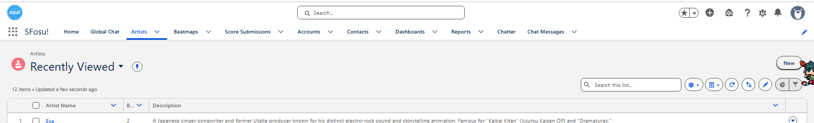

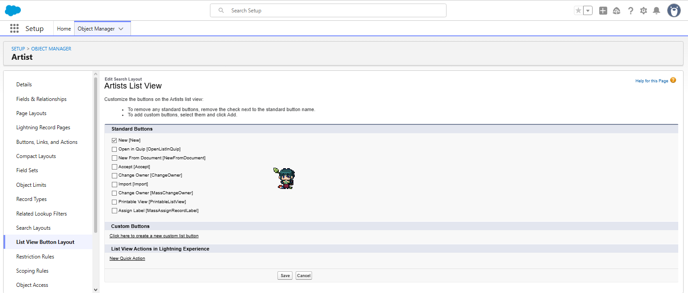

These screenshots show the list view action layout for Artist records. I intentionally kept the visible actions focused and minimal so that the user only sees the most relevant action for creating a new artist entry. The Add New Artist action is the priority. Delete, archive, or edit actions are not part of the current implementation and are better suited for future versions when the project has a clearer admin workflow and permission model.

The main goal is to reduce clutter and make the list view feel cleaner and more purpose-built for the osu! user journey. That keeps the interaction simple while still leaving room for additional administrative actions when they are actually needed.

### Beatmap screen


The Beatmap screen is where content detail becomes more specific and tangible. It introduces the actual playable or browsable content, giving users a first look at the maps, tracks, or music-based material that drives the experience.

#### Beatmap related tab


The Related tab keeps the exploration going by surfacing linked or similar beatmaps and associated content. It helps the user discover more relevant entries instead of stopping at the initial record.

#### Beatmap details tab


When a specific beatmap is opened, the Details tab gives the essential information for that map. This is the first place a user looks to understand the content, difficulty, and overall purpose of the record.

### Score submissions screen


The Score Submissions screen introduces the competitive or performance-tracking side of the app. It tells the viewer that results and achievements are tracked, reviewed, and presented as part of the overall experience.

#### Score submissions details tab


The Details tab is the main view for score submissions and is the only tab in this area. It highlights the specific submission information, making it the most important place for reviewing results and understanding the relevant performance data.

### Accounts screen


The Accounts screen is where the user’s personal identity and profile context are made visible. This tab is important because it gives a sense of ownership, personal details, and the account-level structure that supports the rest of the app.

#### Accounts related tab


The Related tab for Accounts expands the profile context by showing connected or associated content linked to that account. It helps the user continue exploring the account through related entries without losing the main identity context.

#### Accounts details tab


The Details tab provides the key account information in a structured and readable way. It is the place where the app presents the most relevant personal or account-level information in a concise, focused view.

### Contacts screen


The Contacts screen is designed around connection and relationships. It is the place where a user sees who they can reach, who is relevant, and how the app supports communication between people or groups.

#### Contacts related tab


The Related tab for Contacts broadens the social context by surfacing connected people, groups, or relevant entries tied to that contact. It helps the user keep exploring relationships without leaving the contact view.

#### Contacts details tab


The Details tab focuses on the essential information for a selected contact. It gives the clearest view of who that person is and what information is most relevant for communication or follow-up.

### Dashboard screen


The Dashboard is the overview tab where the most important information is surfaced first. It is designed to make a user feel oriented by showing a high-level summary of activity, progress, and key areas of the platform at a glance.

### Reports screen


The Reports screen represents the operational and oversight side of the app. It is the place where data, issues, and summaries are reviewed, signaling that the platform is structured enough to monitor activity and maintain quality.

#### Artist details report outline


This report shows the artist-focused summary and established beatmap detail view first, making it easy to see the overall information structure before narrowing into filters or deeper results.

#### Artist details report filters


The filters for the artist details report let the user narrow the data by the relevant selection criteria, making the report more focused and easier to interpret.

#### Top 10 scores report outline


The Top 10 Scores report outline highlights the ranking structure and the scoring view first, presenting the core information in a clear and immediately readable format.

#### Top 10 scores report filters


The filters for the Top 10 Scores report refine the report by adjusting the scoring criteria, letting the user focus on the ranking view they want to inspect.

#### Top 10 PP plays standard outline


The Top 10 PP Plays Standard report outline presents the standard performance ranking view first, focusing on the most relevant results and how they are framed for comparison.

#### Top 10 PP plays standard filters


The filters for the Standard PP report narrow the data by the relevant performance criteria so the ranking is easier to compare and interpret.

#### Top 5 PP plays mania outline


The Top 5 PP Plays Mania outline focuses on the mania-specific leaderboard structure, giving the user a clear view of how the highest-performing entries are framed and ranked.

#### Top 5 PP plays mania filters


The filters for the Mania PP report refine the view by adjusting the relevant criteria, helping the user isolate the exact performance data they want to review.

### Chatter screen


The Chatter screen is the tab for direct social interaction in the app. It gives the first impression that the platform is not just content-based but also community-driven, encouraging conversation and personal connection.

### Chat messages screen


The Chat Messages screen is where the app feels more alive and immediate. This tab shows the value of ongoing communication, making the first impression one of responsiveness, conversation, and direct interaction.

#### Chat messages related tab


The Related tab for Chat Messages expands the conversation context by surfacing connected content and relevant follow-ups. It helps the user continue exploring the discussion beyond the immediate message.

#### Chat messages details tab


The Details tab focuses on the specific conversation content, making it the place where the user can inspect the full message context and the most important information tied to that exchange.

## Custom objects and standard object model

These objects define the app’s data structure and show how the custom models fit alongside the built-in account and contact objects that support the user and relationship layers of the platform.

### Custom objects overview

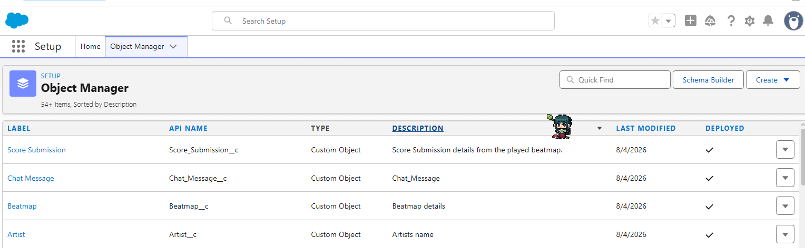

This view shows the custom object model used in the app. It gives a clear picture of the additional domain-specific entities created to support the app beyond the standard built-in objects, helping to explain how the system is structured around its own content and relationship logic.

The object set now clearly includes the key custom records for the app’s content model:

- Artist: a custom object for artist identity and related metadata
- Beatmap: a custom object for beatmap content, details, and game-related record structure
- Score Submission: a custom object tracking submitted play results and performance data
- Chat Message: a custom object representing communication and conversation records

I also explored a few interesting field/data-type patterns in these screenshots. The most useful ones for this app are the relationship-focused types, such as lookup/reference-style fields that connect records to their broader context, along with text and metadata fields for names, descriptions, and entity details. These are the kinds of fields that make the custom objects feel more like a real domain model instead of just isolated tables.

### Artist custom object

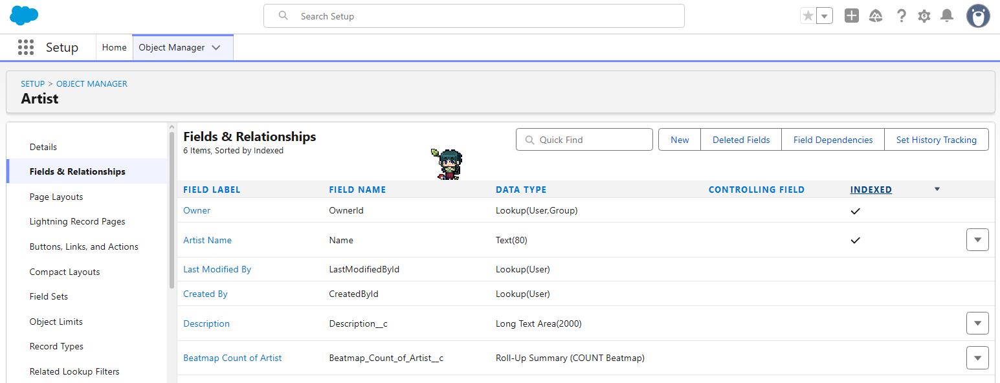

The Artist custom object is one of the most important additions because it gives the app a dedicated place for creative identity data. This lets the project model the people or creators behind the content in a structured way, instead of treating them as simple strings or ad hoc labels.

In this design, an Artist can be the creator or performer associated with a specific song or map, which makes sense for a domain where the artist is conceptually the owner of the music being represented.

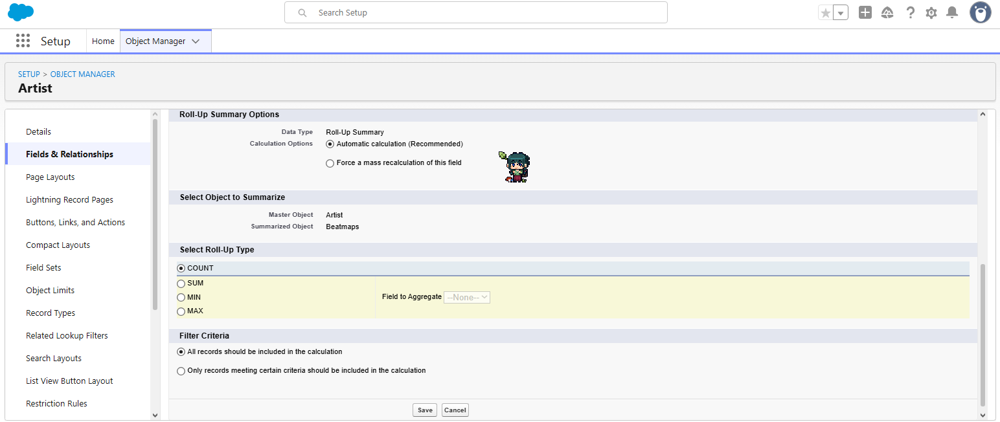

The Number of Beatmaps rollup on the Artist object is essentially a record count of all Beatmap records related to that artist. In other words, it is the number of beatmaps whose Artist field refers to that artist’s name or record. This is a simple summary field that helps show how much content belongs to that artist without needing to manually count related records each time.

### Beatmap custom object

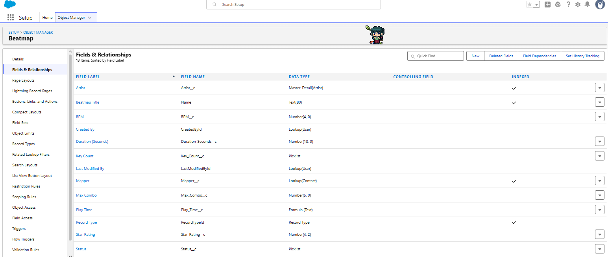

The Beatmap custom object adds the content layer of the project. It represents the actual playable or browsable map information and gives the system a dedicated place to store the details that matter for discovery, comparison, and performance tracking.

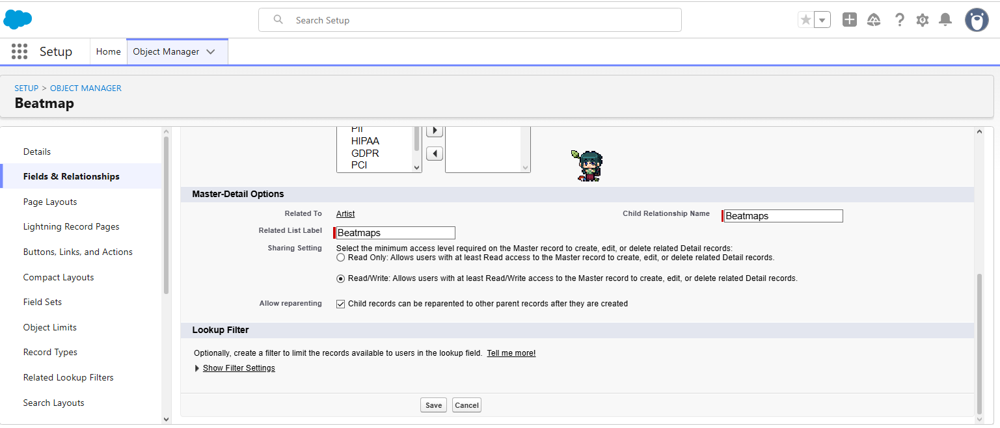

This is also where the Artist relationship fits naturally. If each beatmap is tied to one primary artist, then a master-detail or lookup field on Beatmap pointing to Artist is a sensible design because the beatmap is the child record and the artist is the parent record. In other words, the beatmap belongs to that specific artist for the song represented by that map.

This is a reasonable pattern when the song is clearly attributed to one artist. If a beatmap can legitimately include multiple artists, then a separate junction relationship or a different model would be better. But for the app’s initial structure, using Artist on the Beatmap object is a logical and practical choice.

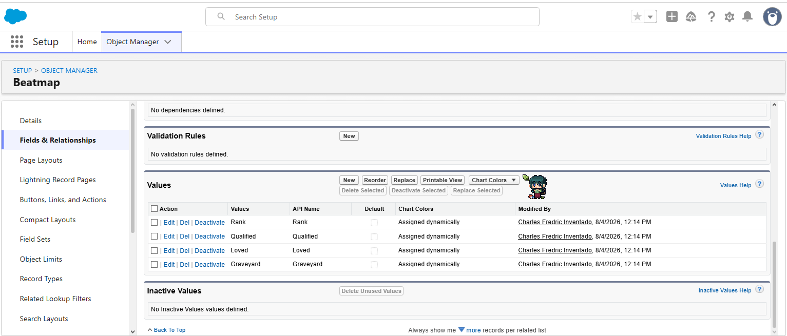

The Beatmap status field is a picklist and it makes sense to reflect the main osu! lifecycle states, such as Ranked, Qualified, Loved, and Graveyard. Those are the core statuses that capture the map’s current state in a clear and familiar way.

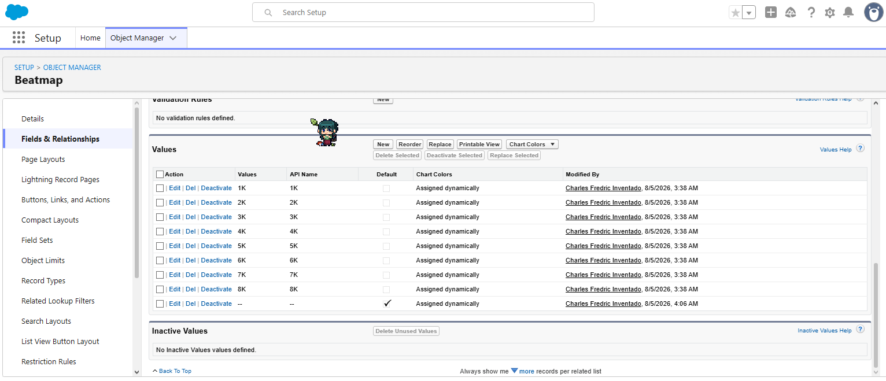

The Key Count field is also a meaningful beatmap attribute. In the osu! mania context, this should represent the number of keys used by the map, typically from 1K up to 8K, while remaining blank for non-mania beatmaps. That matches the idea that mania maps are keyed differently from standard maps, so the count should only be relevant in that specific mode.

This is likely the kind of field that should be constrained with validation and visibility rules. For example, the Key Count field should only be visible or editable when the beatmap is a mania map, and it should either be blank or prevented from being set for non-mania modes. That keeps the model clean and avoids meaningless values being stored on the wrong record type.

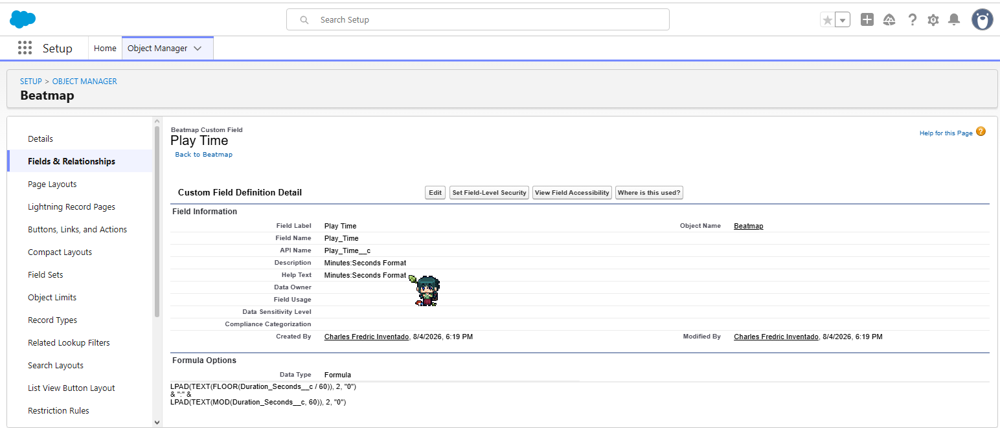

The Play Time formula is a display formula for the beatmap duration. It takes the raw duration in seconds and formats it into a readable mm:ss value, where mm represents the number of minutes and ss represents the remaining seconds. This makes the data easier to read in the UI without exposing the raw numeric duration as the primary display value.

### Standard object: accounts

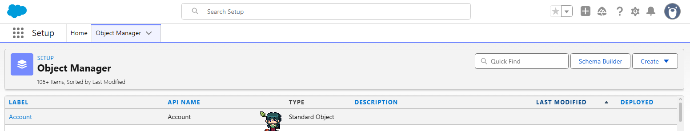

I am using the Accounts standard object to represent osu! clans. In this model, the account is the group or organization layer, which fits the idea of a clan as a broader identity or container for related community members and group-level context.

This setup is useful because it gives the app a natural place for clan-level information, while keeping the actual personal profile details separate from the group record.

### Standard object: contacts

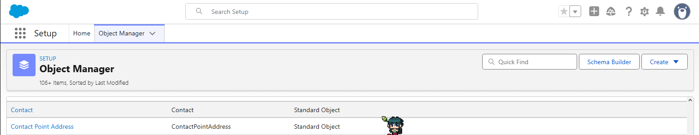

I am using the Contacts standard object to represent the osu! profile. This is the person-level layer: the profile information, personal details, and the identity that belongs to an individual user rather than a group or organization.

This is a good fit for the app because the profile is conceptually closer to an individual record than a company-style account. It also reflects how I am thinking about the data model: keep the clan in Accounts, keep the profile in Contacts, and only include the fields that are actually useful for this app.

A lot of the Salesforce standard columns may be present, but some of them are irrelevant for this project and may not be used initially. The goal is not to mirror every available Salesforce field exactly; it is to start with the relevant parts of the model and add more only when they are needed for the app’s actual functionality.

## Flows created

I created four Salesforce flows in total for the SFosu! project.

### 1. Chat Moderation Filter Flow

- Trigger: record created
- Object: Chat_Message__c
- Entry conditions: none
- Flow type: Fast Field Update
- Behavior: checks each new message for banned or inappropriate words
- Result: if bad words are detected, the message is updated to *Censored*; clean messages remain unchanged

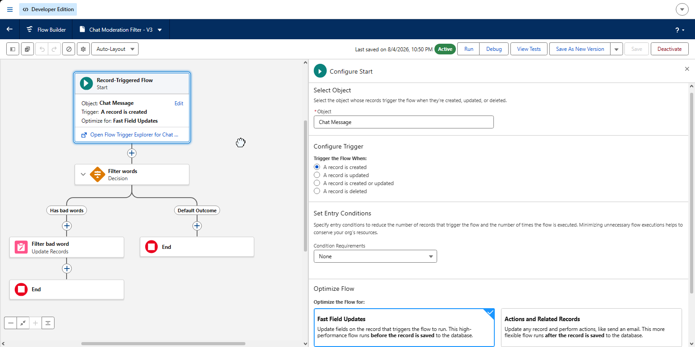

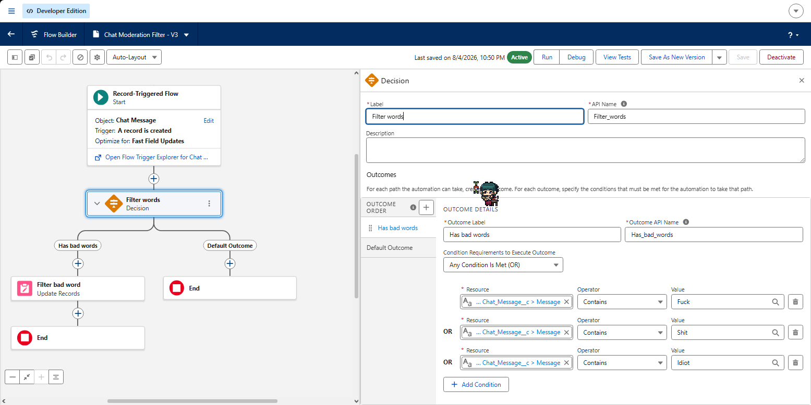

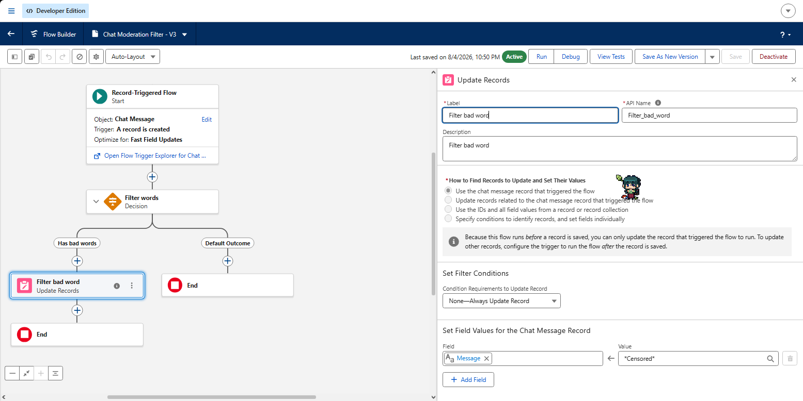

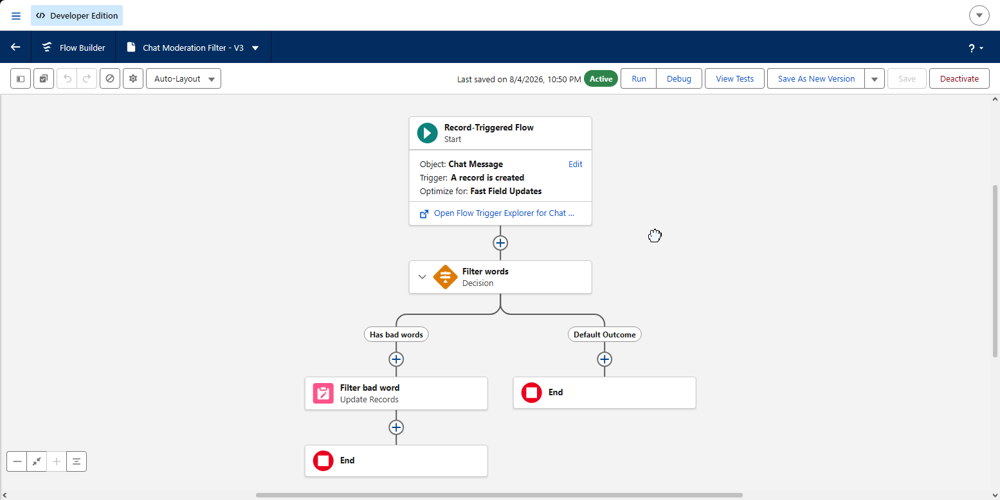

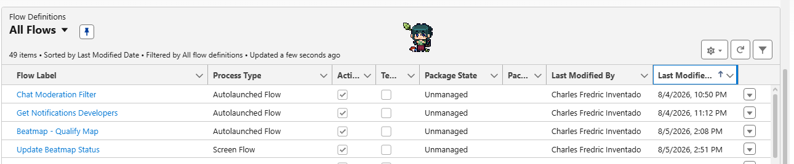

## VS Code setup

The project was developed and validated in VS Code with an authorized Salesforce org connection.

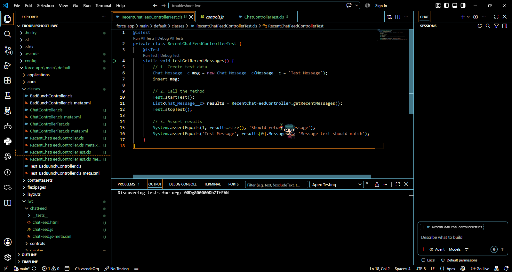

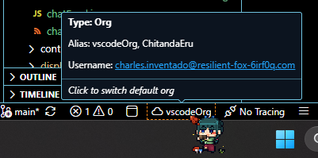

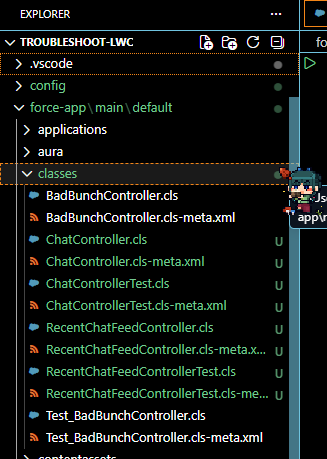

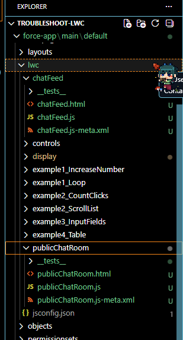

## How I built it from scratch

These images show the early app-manager workflow I used to build the project from the ground up. They document the step-by-step structure I created when designing the app foundation before moving into the full interface and feature work.

### App manager app overview


This is the starting point of the app manager, where the overall app structure and basic foundation were defined. It shows how the project began as a clean, organized system rather than a fully finished interface.

### App manager navigation items


This screen shows the navigation system that was set up early in the process. It highlights the app’s initial structure and how the main sections were planned to guide users through the experience.

The sequence of tabs was intentionally designed to feel logical and progressive. The most important content-driven areas are placed earlier in the flow, with the app prioritizing the core user experience first: Home, then Global Chat, followed by Artist, Beatmaps, and Score-related sections. This keeps the app centered around browsing, exploring, and engaging with the music content before moving into more analytical or secondary views such as Reports and Dashboard.

The idea is that the user should first understand the app’s purpose and explore the music ecosystem, then move into monitoring and higher-level summaries later. In other words, the ordering is meant to support a natural journey: discover content, interact, then review data and analytics.

### App manager user profiles


This part of the app manager focuses on user identity and profile setup. It captures how the app was organized around accounts, user information, and the personal context needed for the rest of the experience.

The System Administrator profile represents the app admin or platform owner, similar to osu! admins who need broad control over data, configuration, and system access. In contrast, the Sfosu!player profile represents a normal osu! player user, which is more restricted and should behave like a regular end-user profile instead of an admin-level one.

The main challenge here is setting the correct permissions, profile settings, and roles so the user can access the right objects and CRUD actions without giving them too much power. The normal player profile should be able to view and update only the records and fields that are relevant to their gameplay and personal profile, while admin users should have the full platform control needed to manage the app.

I also ran into a frustrating issue while testing the standard osu player profile: the app would sometimes switch to the classic Salesforce experience and show a message like "insufficient privilege." That was a sign that the profile still lacked the required object or field access, or that a page/action was trying to load something the user was not allowed to see. This reminds me that profile setup is not just about making a user record exist — it also requires careful attention to the actual permissions behind the scenes.

A random learning I picked up while testing this is that switching the display density from Comfy to Compact and vice versa can help refresh the UI experience on desktop, especially when the screen feels a bit delayed or sluggish. It is not a true fix for permission issues, but it is a practical way to force the page to update visually and give the interface a quick reset when it feels stuck or laggy.

### App manager app details and branding


This screen covers the app details and branding layer, which is where the project starts to feel more complete. It reflects the step where the identity, branding, and key app metadata were defined alongside the functionality.

## Current status

This project is currently in a learning and experimentation phase.

- Some features may be incomplete
- Some parts may not work as expected
- Bugs are expected
- Improvements are ongoing
- The project is meant to grow through trial and error

> Disclaimer: I may have a lot of bugs, broken logic, or unpolished features. I still try my best to apply what I have learned, fix issues when I can, and explain what is happening in the process.

## What I want to achieve

- Learn by building
- Improve my coding and problem-solving skills
- Practice real-world app development
- Keep a record of progress and mistakes
- Share the journey with others who are also learning

## Development approach

This project is a hands-on learning experience. I am focusing on:

- understanding the problem
- trying solutions
- debugging what fails
- testing ideas
- improving step by step
- documenting what I discover

There is no pressure to make everything perfect right away. The important part is learning, adapting, and moving forward.

## Project structure

This repository is currently a starting point for the project and may evolve as development continues.

```text
Sfosu-/
├── README.md
├── assets/
├── src/
├── docs/
├── tests/
└── ...
```

## Getting started

This section will be updated as the project grows.

For now, this is meant as a personal project repository and learning log.

```bash
git clone https://github.com/YourUsername/Sfosu-.git
cd Sfosu-
# Install dependencies here when the project setup is ready
# Run the app here when the project structure is ready
```

## Stack and tools

The actual tech stack will be added as the project is developed.

This project may include technologies such as:

- frontend or mobile framework
- backend or local data handling
- APIs or services
- state management
- testing tools
- UI design and asset work

## Learning goals

I want to keep improving in these areas:

- app architecture
- UI/UX design
- debugging and troubleshooting
- writing maintainable code
- learning from mistakes
- documenting my process clearly

## Vlog / project journey notes

This project is also part of my self-documentation journey. I plan to discuss:

- what I am trying to build
- what I learned from it
- what failed and why
- how I fixed issues
- what I still need to improve
- how the project changes over time

The goal is not to hide the messy parts. The goal is to show honest progress.

## A note about the process

Not everything will be polished.
Not every feature will work perfectly.
Not every idea will succeed on the first try.

But that is part of real development, and I am learning through it.

## Final note

SFosu! is a personal project, a learning journey, and a place to document growth.

I may not have everything figured out yet, but I am trying my best to apply what I have learned and share the process honestly.

Thank you for following along.

---

Built with patience, curiosity, and a lot of trial and error.
